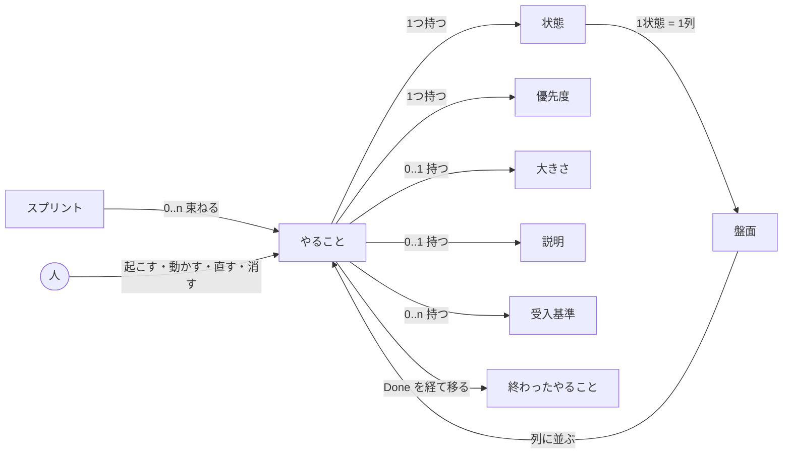

# 概念モデル（意味ネットワーク）

**目的:** UI を描く前に、この領域に何があり、どう繋がっているかを固定する。
画面はこのモデルから導く。モデルに無いものを画面に出さない。

**方法:** モデルベースUIデザイン。人の記憶は意味ネットワークとして繋がっているため、
その繋がりに近い形で画面を構成すると、覚え直さずに使える。

**裏取り:** 下記は `gas/pure_grid_board.js`（`KANBAN_STATUSES`）、`gas/pure_pbi_validate.js`
（`PBI_PRIORITIES` / `PBI_EDITABLE_FIELDS`）、`gas/pure_grid_backlog.js`（`BACKLOG_FIELDS`）、
`gas/pure_board_view.js`（`BOARD_CARD_FIELDS`）で確認済み。

---

## 1. 意味ネットワーク



---

## 2. 対象の定義

| 業務での呼び方 | 内部の実体 | 何であるか |
|---|---|---|
| **やること** | `product_backlog.csv` の1行 | 価値の単位。作成・編集・削除の対象 |
| **タイトル** | `title` 列 | やること の名前。必須（空なら保存しない） |
| **状態** | `status` 列 / 盤面の列 | New / Ready / In Progress / Review / Done（`KANBAN_STATUSES`） |
| **優先度** | `priority` 列 | Critical / High / Medium / Low（`PBI_PRIORITIES`） |
| **大きさ** | `size` 列 | 相対見積り。数値。空を許す |
| **説明** | `description` 列 | 補足説明。自由記述。空を許す |
| **受入基準** | `acceptance_criteria` 列 | 「終わった」と言える条件（③参照） |
| **スプリント** | `sprint` 列 | いつやるかの束（③参照） |
| **盤面** | `buildBoardData` の `columns` | 状態別に並べた やること の集合 |
| **終わったやること** | `product_backlog_done.csv` | 画面に出さない |
| — | `updated_at` | 競合判定の鍵 |
| — | `created_at` | 作成時刻。編集不可 |
| — | `id` | 参照の同一性。ローカルの Claude Code との共有キー |

`status` / `created_at` / `updated_at` を除く6項目が編集可能（`PBI_EDITABLE_FIELDS` は
これに `status` を加えた7項目。`id` / `created_at` / `updated_at` は含めない。
書き換えさせると競合判定と採番の前提が崩れるため）。

---

## 3. 関係の重み

利用者が日常的に辿る道は次の4つに集約される。

```
①見る:   盤面 → 状態別に並んだ やること
②直す:   人 → やること（カードを開く）→ 各項目を編集 → 保存
③動かす: 人 → やること（ドラッグ）→ 状態だけを変える（②を通らない近道）
④起こす: 人 → 列（先に状態が決まる）→ やること
```

②④が業務の起点であり、この順序が**画面の構造を決める**（列から生み、カードを開いて直す）。
③は②のうち状態変更だけを素早く行う近道で、パネルを経由しない。

---

## 4. モデルから導かれる画面構造

対象の種類は「やること」1つだけである。**盤面自体が対象の一覧であり、状態はその列として
モデルにすでに現れている。** 参考元（複数の対象を持つ）のようなタブでビューを切り替える
構造は要らない。

| 画面 | 対応する対象 | 出るタイミング |
|---|---|---|
| 盤面 | 状態別に並んだ やること（集合） | 常に。ホーム |
| 詳細パネル | やること（1件） | カードを開いた／列から起こしたとき |
| 通知 | 消した やること（1件） | 削除の直後。取り消せる間だけ |

**盤面を選ぶ操作は無い。** 対象が1種類しかないため、常に盤面が表示され、パネルは
その上に**覆いかぶさらずに**並ぶ（モードレス）。

---

## 5. 動作と対象の分離

画面の名前・見出しは**対象の名前**にする。動作はボタンにする。

| 対象（画面の名前になる） | 動作（ボタンになる） |
|---|---|
| やること / カード | 起こす・動かす（ドラッグ）・直す・保存する・消す |
| 盤面 | 最新にする |
| 通知 | 取り消す |

「保存」「削除」「最新にする」はいずれも動作であり、カードや列の見出しには使わない。

---

## モデルと画面のずれ

以下の3件は、モデルと実装の食い違いを**記録として残す**ものである。**いずれも画面は
変えない。** 理由を書く場所が無かったことが問題だった。

### 1. スプリントは やること の属性ではなく、やること を束ねる対象である

モデルでは `Sprint --0..n--> PBI` の向きだが、実装は自由入力のテキスト1個（`gas/kanban.html`
の `f-sprint`）で、盤面はスプリントを一切表現していない（列は状態のみ）。

**第2段階では対象外。** 第3段階以降で「スプリントで絞る」を作るかを判断する
（[第2段階の設計書](2026-09-08-web-app-phase2-design.md)の「対象外」節を参照）。

### 2. `updated_at` をカードに生で出している

`gas/pure_board_view.js` の `BOARD_CARD_FIELDS` に含まれ、`gas/kanban.html` の `.card .meta`
に表示している。内部の実体であって業務の語彙ではないが、それでも出しているのは、
**競合が起きたときに人が状況を理解する唯一の手がかり**だからである（「見ていない変更が
ある」と拒否されたとき、更新時刻が出ていれば誰かが触ったことが分かる）。

### 3. 受入基準はモデル上 0..n だが、実体は1本の文字列である

`acceptance_criteria` 列はセミコロン（`;`）区切りの1本の文字列で、`gas/kanban.html` では
ヒント文（「セミコロン（;）で区切ります」）で補っている。`product_backlog.csv` の列構成を
ローカルの Claude Code と共有しており変えられないため、1行1件の構造に分けられない。

**第3段階でコメント（やること に付く 0..n）を足すとき、同じ制約に当たる。**
